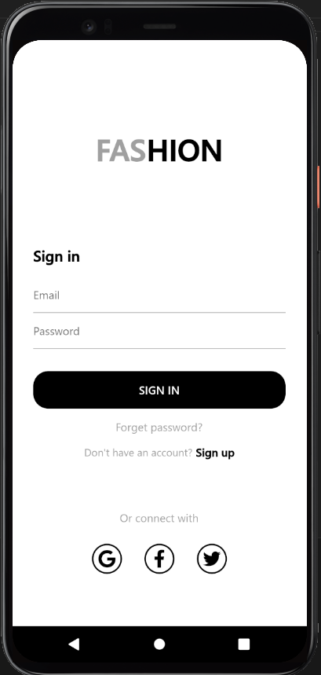

# Flutter Auth App

Welcome to the Flutter Auth App repository! This Flutter project is a simple authentication app featuring a splash screen, sign-in page, and sign-up page. It provides a foundation for integrating user authentication into your Flutter applications.

## Features

- **Splash Screen:** Engaging introduction screen displayed on app launch.
- **Sign-In Page:** Secure user authentication with email and password.
- **Sign-Up Page:** User registration with email, password, and optional additional details.
- **Clean UI Design:** Intuitive and aesthetically pleasing user interface.
- **Easy Customization:** Customize the app with your branding and additional features.

## Screenshots

## Getting Started

To integrate this authentication app into your Flutter project, follow these steps:

1. Clone the repository to your local machine.
2. Copy the relevant files and code snippets into your existing Flutter project.
3. Customize the authentication flow and UI as needed for your application.

## Usage

1. Launch the app to experience the engaging splash screen.
2. Navigate to the sign-in page to log in with your credentials.
3. Alternatively, visit the sign-up page to create a new user account.

